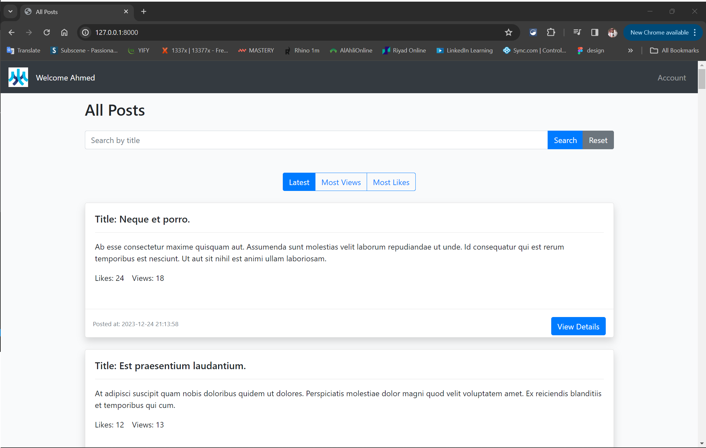

# About Morf webiste

The project is a website that users can posts and they have panel provider to edit and delete there posts and the other users can comments and likes the posts and also we have admin panel that can see all the users and posts and comments in the webiste

## Built With

-   
-   

## Main Features

### Admin panel

  

In the admin panel, you have access to all logged-in users, posts, and comments. You can perform actions such as deletion and view dashboard widgets.

`Access to the admin panel is restricted, and only the admin user has it visible in the menu items.`

---

### User panel

  

In the user panel, you can view your own user information, posts, and comments. You have the ability to edit or delete them and view personalized widgets.

---

### Home page

  

On the home page, you can explore all the latest posts, perform searches, apply filters, and view user details.

---

### Post details

  

In post details, you can explore the complete content of a post. Interact by liking the post, viewing comments, and adding new comments. Other users can also like your comments.

`Commenting requires signing in.`

---

### Search

  

Search for posts using the search functionality. Enter keywords, and the system will display relevant posts.

---

### Filtering

  

Filter posts based on different criteria such as the latest, most views, and most likes.

`The default filter is set to the latest posts.`

---

### Sign in

  

To sign in, click on the account button on the home page. If not signed in, you will be directed to the sign-in page.

---

### Registration

  

To register you will go to register form and fill the form and will route the user to his panel first .

---

<!-- GETTING STARTED -->

## Getting Started

#### Prerequisites

-   PHP
-   Composer
-   Laravel
-   MySQL
-   Filament

## Installation

To get started with this project, follow the steps below:

1. Install the PHP dependencies by running the following command:

`composer install`

2. Install the Filament package by running:

`composer require filament/filament`

3. Install the Filament panels:

`php artisan filament:install --panels`

4. Connect the .env file with your database settings.

5. Create models for your database:

`php artisan make:model`

6. Run database migrations to create the necessary tables:

`php artisan migrate`

7. Start your PHP development server:
   `php artisan serve`

#### Completion

That's it! Congratulations on successfully installing and setting up your PHP Laravel project with Filament. You're now ready to dive into the exciting features and functionalities of your application.
